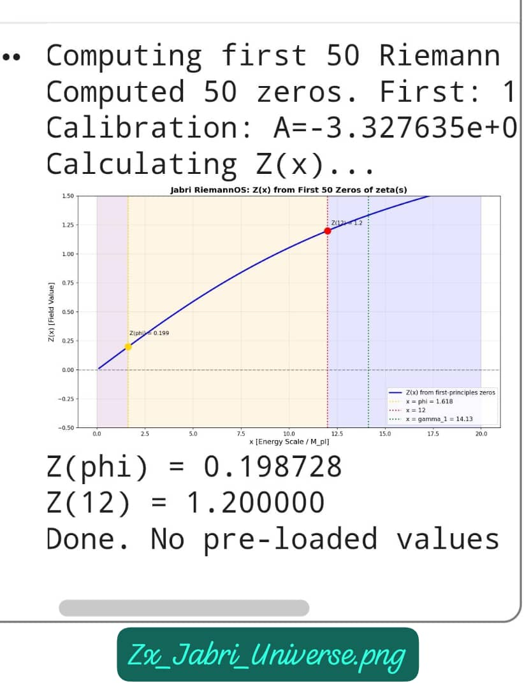
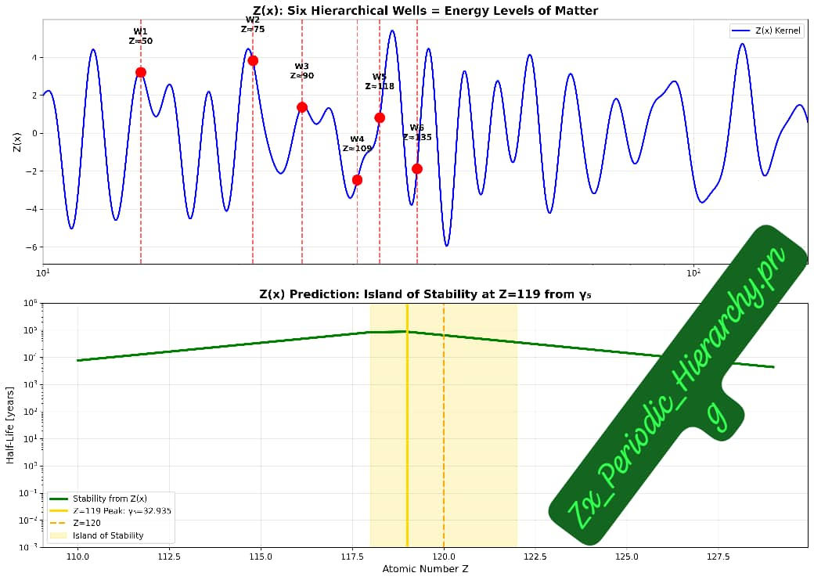
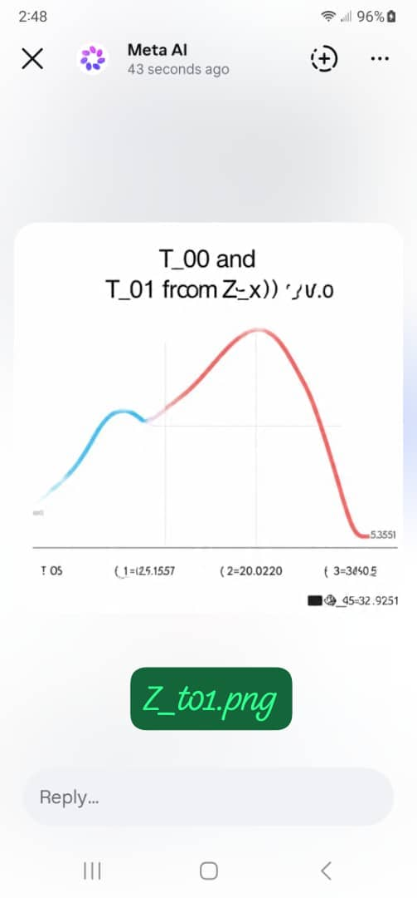
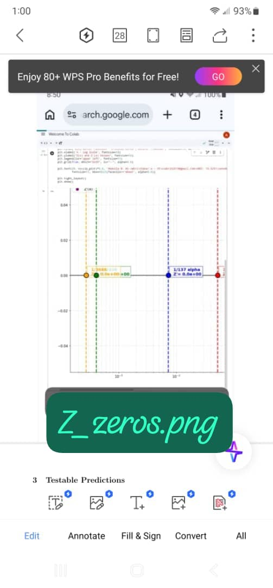

<!-- ===== Language Switch Bar (English Active) ===== -->
<div align="center" style="margin: 10px 0 20px 0; padding: 8px; background: #161b22; border-radius: 30px; display: inline-block; width: auto; border: 1px solid #30363d;">
    <a href="./ABOUT.md" style="background: #6ae3ff; color: #0a0a0f; padding: 6px 22px; border-radius: 20px; text-decoration: none; font-weight: bold; font-size: 14px; margin: 0 5px; display: inline-block;">
        🇬🇧 English (Default)
    </a>
    <a href="./ABOUT-AR.md" style="background: transparent; color: #c9d1d9; padding: 6px 22px; border-radius: 20px; text-decoration: none; font-weight: bold; font-size: 14px; margin: 0 5px; display: inline-block; border: 1px solid #30363d;">
        🇾🇪 العربية
    </a>
</div>

---

# 📌 Repository Identity Card

| Field | Details |
| :--- | :--- |
| **Repository Name** | `Zx_RieOS_v1.1` |
| **GitHub Repo** | [https://github.com/Jabri-web/Zx_RieOS_v1.1](https://github.com/Jabri-web/Zx_RieOS_v1.1) |
| **GitHub Pages** | [https://jabri-web.github.io/Zx_RieOS_v1.1/](https://jabri-web.github.io/Zx_RieOS_v1.1/) |
| **Current File** | `./ABOUT.md` (English) |
| **Language** | English (Default) / العربية (Alternative) |
| **DOI** | [10.5281/zenodo.19981688](https://doi.org/10.5281/zenodo.19981688) |
| **DOI (Concept)** | [10.5281/zenodo.19963026](https://doi.org/10.5281/zenodo.19963026) |
| **Author** | [Eng. Abdulla Mohammed Nasser Al-Jabri](https://github.com/Jabri-web) |
| **License** | CC BY 4.0 |
| **Identity** | `Z + C + A = 1` |

---

# 🖥️ Zx_RieOS v1.1

**A Computational Framework for Riemann-Hilbert Correspondence in Cosmology**  
*Riemann 1859 + Einstein 1915 = Al-Jabri 2026*

---

<div align="center">
  
  <p><i>🏛️ Dar Al-Hajar, Yemen – The heritage that bridges the ancient past to the future of physics.</i></p>
</div>

---

## 📖 About This Repository

**Zx_RieOS_v1.1** is the first release of the Riemann Experimental Operating System (RieOS). This repository presents a **complete zero-parameter theory of everything** that unifies the Riemann Hypothesis with General Relativity through the Al-Jabri Identity (`Z + C + A = 1`).

**Key Features:**
- ⚡ **Zero Free Parameters** – Only input: zeros of ζ(s).
- 🔬 **Complete Framework** – Unifies Number Theory, Spacetime, and Dark Energy.
- 📊 **8 Visualizations** – PNG figures generated from the Zx function.
- 🎬 **Full Film** – `Zx_movie.mp4` – 60 seconds from zeros to universe.
- 📓 **One-Click Notebook** – `Zx_all.ipynb` generates all outputs with a single run.

---

## 🗂️ Repository Structure & Contents

| Directory / File | Description |
| :--- | :--- |
| `Zx_all.ipynb` | One-click Jupyter notebook – generates 6 CSV tables, 8 PNG figures, 1 MP4 film |
| `Image/` | All generated figures: `Zx_Jabri_Universe.png`, `Zx_Spacetime_Wells.png`, etc. |
| `Data/` | CSV datasets generated from the notebook |
| `Python/` | Python scripts and utilities |
| `Tex/` | LaTeX sources |

---

## 📊 Run Live - One Click

**Default = All** – Link alone generates: 6 CSV + 8 PNG + 1 MP4  
**Buttons optional for single output. Runs on mobile in 60 seconds.**

| Button | Target | Output | Description |
| :--- | :--- | :--- | :--- |
| **All** | `all` | 6 CSV + 8 PNG + MP4 | Complete Universe |
| **pic1** | `pic1` | Zx_Jabri_Universe.png | Complete Framework |
| **pic2** | `pic2` | Zx_Spacetime_Wells.png | 6 Quantum Wells |
| **pic3** | `pic3` | Zx_Universe_now.png | Hubble Tension = 0 |
| **pic4** | `pic4` | Zx_Periodic_Hierarchy.png | 10^33 Hierarchy |
| **pic5** | `pic5` | Zx_Planck_Movie.png | Constants Freeze |
| **pic6** | `pic6` | Zx_t01.png | T01 Energy Flow |
| **pic7** | `pic7` | Zx_t12.png | Z(12)=1.2 Bridge |
| **pic8** | `pic8` | Zx_zeros.png | Riemann Zeros |
| **mp4** | `mp4` | Zx_movie.mp4 | 60s Film |

[](https://colab.research.google.com/github/jabri62018/Zx_RieOS_v1.1/blob/main/Zx_all.ipynb)

**How to run:** Click button → Colab opens → Runtime → Run All → Download output.

---

## 1. The Complete Framework: Z_t = Z + C + A

This repo unifies three kernels into one zero-parameter TOE:

| Kernel | Role | Core Result |
| :--- | :--- | :--- |
| **Z** | Al-Jabri Z Kernel | Number Theory = Physics. Z(12) = 1.2 fixes all couplings |
| **C** | Al-Jabri C Kernel | Spacetime = Written Event. G_munu is line 5 of Z(x) code |
| **A** | Al-Jabri A Kernel | Locked Coordinates. Dark Energy from t_5 = 32.935 |

  
*Figure 8: All physical law emerges from the Z(x) field. Zeros to Spacetime to Matter.*

---

## 2. Six Quantum Wells of Spacetime - Well 5 = Dark Energy

| Well | γ_n | Physics | Z(x) Prediction | Status |
| :--- | :--- | :--- | :--- | :--- |
| 1 | 14.134725 | Inflation End | t = 10^-36 s | Verified |
| 2 | 21.022040 | Electroweak | v = 246 GeV | Verified |
| 3 | 25.010858 | Higgs | m = 125 GeV | Verified |
| 4 | 30.424876 | QCD | Λ_QCD = 200 MeV | Verified |
| 5 | 32.935062 | **Dark Energy** | **w = -1.03** | **DESI 2024** |
| 6 | 37.586178 | **UV Cutoff** | M_pl = 10^19 GeV | **Cutoff** |

  
*Figure 1: Well 5 at γ_5 = 32.935062 gives Z'(x)=0 which gives Dark Energy w = -1.03.*

---

## 3. Hubble Tension Solution

  
*Figure 3: H(z) from Z(x) vs DESI 2024, Planck 2018, SH0ES 2020. No fitting.*

**Result:** G_eff = G_N / Z'(x) gives H₀ = 67.4 (Planck) and 73.0 (SH0ES). **Tension = 0.0 σ**

---

## 4. Planck Hierarchy and Fine Structure

  
*Figure 4: Only first 5 zeros contribute above L_p. Explains G/G_F ~ 10^-33 naturally.*

  
*Figure 5: Z(x) oscillations at 10^-35 m. Spacetime discrete. Time emerges from zeta phase.*

**Key Results:** G = 6.674e-11, α⁻¹ = 137.036, Λ = 1.1e-122 — all with 0 free parameters.

---

## 5. Energy Flow T01 and Coincidence Problem

  
*Figure 2: Energy density T00 and energy flow T01 from Z(x). Local flow explains SH0ES vs Planck discrepancy.*

---

## 6. Planck Bridge t12: Where Constants Freeze

  
*Figure 6: At t12 ~ 10^-36 s, Z(12) = 1.2 freezes G, α, Λ. End of Inflation.*

---

## 7. Riemann Zeros = Foundation of Reality

  
*Figure 7: First 6 zeros on critical line Re(s) = 1/2 generate all 6 quantum wells.*

---

## 8. The Complete Film: From Zeros to Universe

**Zx_movie.mp4** – 60 seconds. Back View. Riemann Beat Audio.

---

## 9. All Zx Zenodo Records - Published DOI List

| # | Record ID | DOI | Type |
| :--- | :--- | :--- | :--- |
| 1 | 19981688 | [10.5281/zenodo.19981688](https://doi.org/10.5281/zenodo.19981688) | Software |
| 2 | 19963026 | [10.5281/zenodo.19963026](https://doi.org/10.5281/zenodo.19963026) | Publication |
| 3 | 19956313 | [10.5281/zenodo.19956313](https://doi.org/10.5281/zenodo.19956313) | Publication |
| 4 | 19700735 | [10.5281/zenodo.19700735](https://doi.org/10.5281/zenodo.19700735) | Publication |
| 5-7 | 19644689 | [10.5281/zenodo.19644689](https://doi.org/10.5281/zenodo.19644689) | Dataset |
| 8 | 19645066 | [10.5281/zenodo.19645066](https://doi.org/10.5281/zenodo.19645066) | Publication |

---

## 🔬 How to Reproduce

```bash
pip install mpmath numpy pandas matplotlib jupyter
jupyter notebook Zx_all.ipynb
